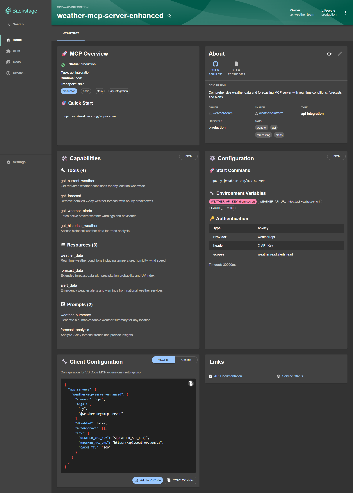

# @mexl/backstage-plugin-catalog-backend-module-mcp

Add **MCP (Model Context Protocol) entity support** to your Backstage software catalog.

[](https://www.npmjs.com/package/@mexl/backstage-plugin-catalog-backend-module-mcp)
[](https://opensource.org/licenses/Apache-2.0)

## 🌟 Features

- **Complete MCP Entity Kind**: Full support for MCP servers in your Backstage catalog
- **Rich Validation**: Comprehensive validation for MCP entity configurations
- **Relationship Modeling**: Automatic relationship generation (dependencies, ownership, API provision)
- **Multi-Transport Support**: stdio, SSE, WebSocket, and HTTP transports
- **Multiple Runtimes**: Node.js, Python, Go, C#, Rust, and Java
- **Search Integration**: Automatic inclusion in Backstage search
- **Comprehensive Examples**: 5 real-world examples included

## 🚀 Step-by-Step Setup Guide

Follow these steps to add MCP entity support to your Backstage application:

### Step 1: Install the Plugin

```bash
# In your Backstage app root directory
yarn --cwd packages/backend add @mexl/backstage-plugin-catalog-backend-module-mcp
```

Or alternatively:
```bash
cd packages/backend
yarn add @mexl/backstage-plugin-catalog-backend-module-mcp
cd ../..
```

### Step 2: Register the Backend Module

Add the MCP module to your Backstage backend:

```typescript
// packages/backend/src/index.ts
import { createBackend } from '@backstage/backend-defaults';

const backend = createBackend();

// ... your existing plugins
backend.add(import('@backstage/plugin-app-backend'));
backend.add(import('@backstage/plugin-proxy-backend'));
backend.add(import('@backstage/plugin-scaffolder-backend'));
backend.add(import('@backstage/plugin-techdocs-backend'));

// Add MCP catalog module
backend.add(import('@mexl/backstage-plugin-catalog-backend-module-mcp'));

backend.start();
```

> **Note**: This plugin requires Backstage version `1.0.0` or higher.

### Step 3: Update Catalog Configuration

Update your `app-config.yaml` to allow MCP entities:

```yaml
catalog:
  rules:
    - allow: [Component, System, API, Resource, Location, MCP]  # Add MCP here
  locations:
    # Add your MCP entities file
    - type: file
      target: ../../catalog-info/mcp-entities.yaml
      rules:
        - allow: [MCP]
```

### Step 4: Create Your First MCP Entity

Create a file `catalog-info/mcp-entities.yaml`:

```yaml
apiVersion: backstage.io/v1alpha1
kind: MCP
metadata:
  name: my-first-mcp
  description: "My first MCP server for file operations"
spec:
  transport: stdio
  runtime: node
  type: file-processor
  lifecycle: experimental
  owner: my-team
  capabilities:
    tools: ["read_file", "write_file", "list_files"]
  configuration:
    command: "npx"
    args: ["-y", "@my-org/file-mcp-server"]
    timeout: 30000
```

### Step 5: Restart Backstage

```bash
# Restart your Backstage backend
yarn dev
```

### Step 6: Verify Installation
Import your first MCP entity

Visit your Backstage instance and navigate to the Catalog. You should now see your MCP entity listed. You can verify by:

1. Going to the "All" tab in the catalog
2. Filtering by Kind = "MCP" 
3. You should see "my-first-mcp" entity with its description


For MCP entity visualization, install the companion frontend plugin:

```bash
yarn --cwd packages/app add @mexl/backstage-plugin-mcp-frontend
```



*Enhanced MCP entity page with interactive cards*

See [@mexl/backstage-plugin-mcp-frontend](https://www.npmjs.com/package/@mexl/backstage-plugin-mcp-frontend) for setup instructions.

## 📋 Entity Schema

MCP entities follow this schema:

```yaml
apiVersion: backstage.io/v1alpha1
kind: MCP
metadata:
  name: my-mcp-server
  description: "Description of your MCP server"
spec:
  # Transport method
  transport: stdio | sse | websocket | http
  
  # Runtime environment  
  runtime: node | python | go | csharp | rust | java
  
  # Server type
  type: data-connector | tool-provider | workflow-automation | api-integration | file-processor
  
  # Lifecycle stage
  lifecycle: experimental | production | deprecated
  
  # Ownership
  owner: team-name
  system: system-name  # optional
  
  # Capabilities
  capabilities:
    tools: ["tool1", "tool2"]           # Functions provided
    resources: ["resource1", "resource2"] # Data accessible  
    prompts: ["prompt1", "prompt2"]     # Template prompts
  
  # Connection configuration
  configuration:
    command: "npx"                      # For stdio transport
    args: ["-y", "@my/mcp-server"]
    url: "https://my-server.com/mcp"    # For remote transports
    timeout: 30000
    env:
      - name: "API_KEY"
        valueFrom: "secret"
  
  # Authentication (optional)
  authentication:
    type: oauth2 | api-key | bearer | basic | none
    provider: "oauth-provider"
    config:
      scopes: ["read", "write"]
  
  # Relationships (optional)
  dependsOn: ["api:weather-api", "database"]
  consumedBy: ["component:my-app"]
```

## 📚 Examples

### Basic stdio MCP Server

```yaml
apiVersion: backstage.io/v1alpha1
kind: MCP
metadata:
  name: simple-file-mcp
  description: "Simple file operations MCP server"
spec:
  transport: stdio
  runtime: node
  type: file-processor
  lifecycle: production
  owner: platform-team
  capabilities:
    tools: ["read_file", "write_file", "list_files"]
  configuration:
    command: "npx"
    args: ["-y", "@my-org/file-mcp"]
    timeout: 30000
```

### Remote HTTP MCP Server

```yaml
apiVersion: backstage.io/v1alpha1
kind: MCP
metadata:
  name: api-integration-mcp
  description: "API integration MCP server"
spec:
  transport: http
  runtime: python
  type: api-integration
  lifecycle: production
  owner: integration-team
  capabilities:
    tools: ["call_api", "transform_data"]
    resources: ["api_schemas", "response_cache"]
  configuration:
    url: "https://api-mcp.company.com/v1"
    timeout: 45000
  authentication:
    type: oauth2
    provider: "company-sso"
  dependsOn: ["api:external-service"]
```

See [examples/](./examples/) directory for comprehensive examples including all transport types and configurations.


MCP entities are automatically searchable:

```bash
# Find all MCP servers
kind:MCP

# Find by runtime
kind:MCP runtime:python

# Find by transport  
kind:MCP transport:stdio

# Find by capabilities
kind:MCP tools:weather

# Find by team
kind:MCP owner:platform-team

# Combined searches
kind:MCP runtime:node transport:stdio lifecycle:production
```


## 🤝 Contributing

Contributions welcome! Please:

1. Fork the repository
2. Create a feature branch
3. Add tests for new functionality
4. Ensure all tests pass
5. Submit a pull request

## 📄 License

Apache License 2.0 - see [LICENSE](LICENSE) file for details.

## 🔗 Links

- [NPM Package](https://www.npmjs.com/package/@mexl/backstage-plugin-catalog-backend-module-mcp)
- [GitHub Repository](https://github.com/mexl/backstage-plugin-mcp)
- [Backstage.io](https://backstage.io/)
- [Model Context Protocol](https://modelcontextprotocol.io/)
- [Issues & Support](https://github.com/mexl/backstage-plugin-mcp/issues)

---

**Made with ❤️ for the Backstage community**